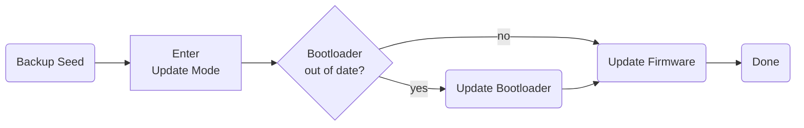

## Update Flow
1. **Backup seed** → 2. Enter **Update Mode** (hold button while plugging) → 3. Desktop prompts **Bootloader** then **Firmware** → 4. Re-enter PIN.

```mermaid
flowchart LR
  A(Backup Seed) --> B[Enter<br>Update Mode]
  B --> C{Bootloader<br>out of date?}
  C -- yes --> D(Update Bootloader)
  C -- no --> E(Update Firmware)
  D --> E(Update Firmware)
  E --> F(Done)
```
